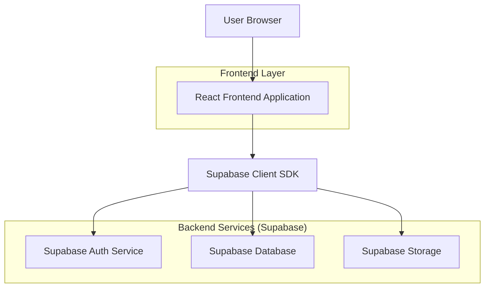
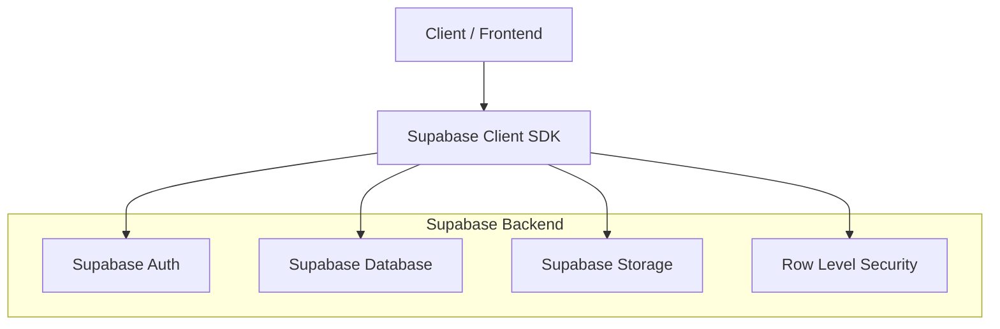
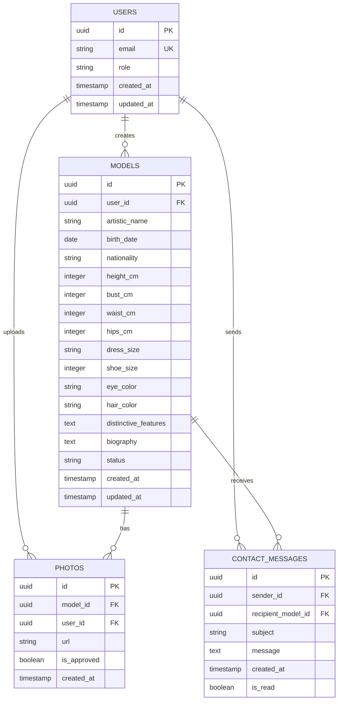

## 1. Architecture design



## 2. Technology Description
- Frontend: React@18 + tailwindcss@3 + vite
- Initialization Tool: vite-init
- Backend: Supabase (Backend-as-a-Service)
- Database: PostgreSQL (via Supabase)
- Authentication: Supabase Auth
- File Storage: Supabase Storage con Image Transformations CDN
- UI Animations: framer-motion@10
- Image Gallery: react-image-gallery@1.3
- Form Handling: react-hook-form@7 + zod@3
- Full-Text Search: PostgreSQL tsvector
- Email Service: Supabase Edge Functions + Resend
- Rate Limiting: Supabase Edge Functions
- Video Optimization: WebM con lazy loading

## 3. Route definitions
| Route | Purpose |
|-------|---------|
| / | Home page con hero section y grid de modelos destacadas |
| /search | Buscador con filtros avanzados y grid de resultados |
| /model/:id | Perfil completo del modelo con galería y estadísticas |
| /login | Página de autenticación para usuarios registrados |
| /register | Formulario de registro diferenciado por tipo de usuario |
| /profile | Panel de usuario para modelos (edición de perfil) |
| /admin | Panel de administración para moderación de contenidos |
| /contact/:modelId | Formulario de contacto directo con modelos |

## 4. API definitions

### 4.1 Authentication API
```
POST /auth/v1/token
```

Request:
| Param Name | Param Type | isRequired | Description |
|------------|------------|------------|-------------|
| email | string | true | Email del usuario |
| password | string | true | Contraseña (mínimo 6 caracteres) |

Response:
| Param Name | Param Type | Description |
|------------|------------|-------------|
| access_token | string | JWT token para autenticación |
| refresh_token | string | Token para renovar sesión |
| user | object | Datos del usuario autenticado |

### 4.2 Models API
```
GET /rest/v1/models
```

Query Parameters:
| Param Name | Param Type | Description |
|------------|------------|-------------|
| age_min | number | Edad mínima del modelo |
| age_max | number | Edad máxima del modelo |
| height_min | number | Estatura mínima en cm |
| height_max | number | Estatura máxima en cm |
| nationality | string | Nacionalidad del modelo |
| eye_color | string | Color de ojos |
| hair_color | string | Color de cabello |
| status | string | Estado de aprobación (approved/pending) |

Response:
```json
{
  "id": "uuid",
  "artistic_name": "string",
  "birth_date": "date",
  "nationality": "string",
  "height_cm": "number",
  "measurements": {
    "bust": "number",
    "waist": "number", 
    "hips": "number"
  },
  "dress_size": "string",
  "shoe_size": "number",
  "eye_color": "string",
  "hair_color": "string",
  "distinctive_features": "string",
  "biography": "text",
  "photos": ["url1", "url2"],
  "status": "approved|pending|rejected"
}
```

### 4.3 File Upload API
```
POST /storage/v1/object/models/:userId/:filename
```

Headers:
| Header Name | Value |
|-------------|--------|
| Authorization | Bearer {access_token} |
| Content-Type | multipart/form-data |

### 4.4 Image Transformation API
```
GET /storage/v1/object/public/model-photos/:path?width=500&quality=80&format=webp
```

Query Parameters:
| Param Name | Description | Example |
|------------|-------------|---------|
| width | Ancho en píxeles | 500 |
| height | Alto en píxeles | 750 |
| quality | Calidad 1-100 | 80 |
| format | Formato de salida | webp |

### 4.5 Contact Message API (Rate Limited)
```
POST /api/contact-message
```

Request:
| Param Name | Type | Required | Description |
|------------|------|----------|-------------|
| model_id | uuid | true | ID del modelo destinatario |
| subject | string | true | Asunto del mensaje (max 200 chars) |
| message | string | true | Mensaje (filtrado por anti-spam) |

Response:
```json
{
  "success": true,
  "message_id": "uuid",
  "rate_limit_remaining": 4
}
```

### 4.6 Full-Text Search API
```
GET /api/search-models
```

Query Parameters:
| Param Name | Type | Description |
|------------|------|-------------|
| q | string | Término de búsqueda (biografía, características) |
| nationality | string | Filtro por nacionalidad |
| age_min | number | Edad mínima |
| age_max | number | Edad máxima |

Example:
```
GET /api/search-models?q=tatuaje+cuello&nationality=colombiana
```

## 5. Server architecture diagram


## 6. Data model

### 6.1 Data model definition


### 6.2 Data Definition Language

Users Table (users)
```sql
-- create table
CREATE TABLE users (
  id UUID PRIMARY KEY DEFAULT gen_random_uuid(),
  email VARCHAR(255) UNIQUE NOT NULL,
  role VARCHAR(20) NOT NULL CHECK (role IN ('model', 'client', 'admin')),
  created_at TIMESTAMP WITH TIME ZONE DEFAULT NOW(),
  updated_at TIMESTAMP WITH TIME ZONE DEFAULT NOW()
);

-- enable RLS
ALTER TABLE users ENABLE ROW LEVEL SECURITY;

-- policies
CREATE POLICY "Users can view own profile" ON users
  FOR SELECT USING (auth.uid() = id);

CREATE POLICY "Admin can view all users" ON users
  FOR SELECT USING (auth.jwt() ->> 'role' = 'admin');

-- Trigger para sincronizar rol en JWT custom claims
CREATE OR REPLACE FUNCTION sync_user_role_to_jwt()
RETURNS TRIGGER AS $$
BEGIN
  -- Actualizar custom claims en auth.users
  UPDATE auth.users 
  SET raw_app_meta_data = jsonb_set(
    COALESCE(raw_app_meta_data, '{}'), 
    '{role}', 
    to_jsonb(NEW.role)
  )
  WHERE id = NEW.id;
  RETURN NEW;
END;
$$ LANGUAGE plpgsql;

CREATE TRIGGER trigger_sync_user_role
  AFTER INSERT OR UPDATE ON users
  FOR EACH ROW EXECUTE FUNCTION sync_user_role_to_jwt();
```

Models Table (models)
```sql
-- create table
CREATE TABLE models (
  id UUID PRIMARY KEY DEFAULT gen_random_uuid(),
  user_id UUID REFERENCES users(id) ON DELETE CASCADE,
  artistic_name VARCHAR(100) NOT NULL,
  birth_date DATE NOT NULL,
  nationality VARCHAR(50) NOT NULL,
  height_cm INTEGER CHECK (height_cm BETWEEN 140 AND 220),
  bust_cm INTEGER CHECK (bust_cm BETWEEN 70 AND 150),
  waist_cm INTEGER CHECK (waist_cm BETWEEN 50 AND 120),
  hips_cm INTEGER CHECK (hips_cm BETWEEN 70 AND 150),
  dress_size VARCHAR(10),
  shoe_size INTEGER CHECK (shoe_size BETWEEN 30 AND 50),
  eye_color VARCHAR(30),
  hair_color VARCHAR(30),
  distinctive_features TEXT,
  biography TEXT,
  status VARCHAR(20) DEFAULT 'pending' CHECK (status IN ('pending', 'approved', 'rejected')),
  created_at TIMESTAMP WITH TIME ZONE DEFAULT NOW(),
  updated_at TIMESTAMP WITH TIME ZONE DEFAULT NOW()
);

-- indexes
CREATE INDEX idx_models_user_id ON models(user_id);
CREATE INDEX idx_models_status ON models(status);
CREATE INDEX idx_models_height ON models(height_cm);
CREATE INDEX idx_models_nationality ON models(nationality);

-- enable RLS
ALTER TABLE models ENABLE ROW LEVEL SECURITY;

-- policies
CREATE POLICY "Models are viewable when approved" ON models
  FOR SELECT USING (status = 'approved');

CREATE POLICY "Models can edit own profile" ON models
  FOR UPDATE USING (auth.uid() = user_id);

CREATE POLICY "Admin can moderate models" ON models
  FOR ALL USING (auth.jwt() ->> 'role' = 'admin');
```

Photos Table (photos)
```sql
-- create table
CREATE TABLE photos (
  id UUID PRIMARY KEY DEFAULT gen_random_uuid(),
  model_id UUID REFERENCES models(id) ON DELETE CASCADE,
  user_id UUID REFERENCES users(id) ON DELETE CASCADE,
  url TEXT NOT NULL,
  is_approved BOOLEAN DEFAULT false,
  created_at TIMESTAMP WITH TIME ZONE DEFAULT NOW()
);

-- indexes
CREATE INDEX idx_photos_model_id ON photos(model_id);
CREATE INDEX idx_photos_user_id ON photos(user_id);
CREATE INDEX idx_photos_approved ON photos(is_approved);

-- enable RLS
ALTER TABLE photos ENABLE ROW LEVEL SECURITY;

-- policies
CREATE POLICY "Approved photos are viewable" ON photos
  FOR SELECT USING (is_approved = true OR auth.uid() = user_id);

-- Índice para búsqueda full-text
ALTER TABLE models ADD COLUMN search_vector tsvector;

CREATE OR REPLACE FUNCTION update_search_vector()
RETURNS TRIGGER AS $$
BEGIN
  NEW.search_vector := 
    setweight(to_tsvector('spanish', COALESCE(NEW.biography, '')), 'A') ||
    setweight(to_tsvector('spanish', COALESCE(NEW.distinctive_features, '')), 'B') ||
    setweight(to_tsvector('spanish', COALESCE(NEW.artistic_name, '')), 'C');
  RETURN NEW;
END;
$$ LANGUAGE plpgsql;

CREATE TRIGGER trigger_update_search_vector
  BEFORE INSERT OR UPDATE ON models
  FOR EACH ROW EXECUTE FUNCTION update_search_vector();

CREATE INDEX idx_models_search ON models USING GIN(search_vector);

CREATE POLICY "Users can upload own photos" ON photos
  FOR INSERT WITH CHECK (auth.uid() = user_id);

CREATE POLICY "Admin can moderate photos" ON photos
  FOR UPDATE USING (auth.jwt() ->> 'role' = 'admin');
```

Contact Messages Table (contact_messages)
```sql
-- create table
CREATE TABLE contact_messages (
  id UUID PRIMARY KEY DEFAULT gen_random_uuid(),
  sender_id UUID REFERENCES users(id) ON DELETE CASCADE,
  recipient_model_id UUID REFERENCES models(id) ON DELETE CASCADE,
  subject VARCHAR(200) NOT NULL,
  message TEXT NOT NULL,
  is_read BOOLEAN DEFAULT false,
  created_at TIMESTAMP WITH TIME ZONE DEFAULT NOW()
);

-- indexes
CREATE INDEX idx_contact_sender ON contact_messages(sender_id);
CREATE INDEX idx_contact_recipient ON contact_messages(recipient_model_id);
CREATE INDEX idx_contact_created ON contact_messages(created_at DESC);

-- enable RLS
ALTER TABLE contact_messages ENABLE ROW LEVEL SECURITY;

-- policies
CREATE POLICY "Users can send messages" ON contact_messages
  FOR INSERT WITH CHECK (auth.uid() = sender_id AND is_subscription_active(auth.uid()));

-- Función para verificar suscripción activa
CREATE OR REPLACE FUNCTION is_subscription_active(user_id UUID)
RETURNS BOOLEAN AS $$
BEGIN
  -- Verificar si el usuario tiene suscripción activa o es cliente premium
  RETURN EXISTS (
    SELECT 1 FROM users 
    WHERE id = user_id 
    AND (role = 'admin' OR role = 'premium_client')
  );
END;
$$ LANGUAGE plpgsql;

CREATE POLICY "Models can view messages to them" ON contact_messages
  FOR SELECT USING (auth.uid() IN (
    SELECT user_id FROM models WHERE id = recipient_model_id
  ));
```

### 6.3 Supabase Storage Configuration
```sql
-- Create storage bucket for model photos
INSERT INTO storage.buckets (id, name, public, file_size_limit, allowed_mime_types)
VALUES ('model-photos', 'model-photos', true, 5242880, ARRAY['image/jpeg', 'image/png', 'image/webp']);

-- Storage policies for model photos
CREATE POLICY "Model photos are publicly accessible" ON storage.objects
  FOR SELECT USING (bucket_id = 'model-photos' AND (metadata->>'is_approved')::boolean = true);

CREATE POLICY "Authenticated users can upload photos" ON storage.objects
  FOR INSERT WITH CHECK (
    bucket_id = 'model-photos' AND 
    auth.role() = 'authenticated' AND
    (metadata->>'user_id')::uuid = auth.uid()
  );

CREATE POLICY "Admin can manage all photos" ON storage.objects
  FOR ALL USING (
    bucket_id = 'model-photos' AND 
    auth.jwt() ->> 'role' = 'admin'
  );
```

### 6.4 Functions and Triggers
```sql
-- Function to calculate age from birth_date
CREATE OR REPLACE FUNCTION calculate_age(birth_date DATE)
RETURNS INTEGER AS $$
BEGIN
  RETURN DATE_PART('year', AGE(CURRENT_DATE, birth_date));
END;
$$ LANGUAGE plpgsql IMMUTABLE;

-- Trigger to update updated_at timestamp
CREATE OR REPLACE FUNCTION update_updated_at_column()
RETURNS TRIGGER AS $$
BEGIN
  NEW.updated_at = NOW();
  RETURN NEW;
END;
$$ LANGUAGE plpgsql;

-- Apply updated_at trigger to models table
CREATE TRIGGER update_models_updated_at 
  BEFORE UPDATE ON models 
  FOR EACH ROW 
  EXECUTE FUNCTION update_updated_at_column();

-- Function to get approved models with age calculation
CREATE OR REPLACE FUNCTION get_approved_models()
RETURNS TABLE (
  id UUID,
  artistic_name VARCHAR,
  age INTEGER,
  nationality VARCHAR,
  height_cm INTEGER,
  measurements JSON,
  eye_color VARCHAR,
  hair_color VARCHAR,
  main_photo TEXT
) AS $$
BEGIN
  RETURN QUERY
  SELECT 
    m.id,
    m.artistic_name,
    calculate_age(m.birth_date) as age,
    m.nationality,
    m.height_cm,
    json_build_object(
      'bust', m.bust_cm,
      'waist', m.waist_cm,
      'hips', m.hips_cm
    ) as measurements,
    m.eye_color,
    m.hair_color,
    (SELECT p.url FROM photos p WHERE p.model_id = m.id AND p.is_approved = true LIMIT 1) as main_photo
  FROM models m
  WHERE m.status = 'approved';
END;
$$ LANGUAGE plpgsql;
```