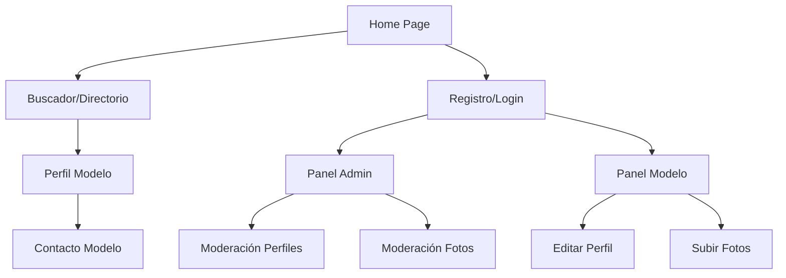

## 1. Product Overview

BellasGlamour.com es una plataforma exclusiva de conexión entre modelos y empresas del mundo de la moda y la publicidad. Diseñada con una estética de lujo y elegancia nocturna, facilita el contacto profesional entre talento y oportunidades comerciales.

El producto resuelve la necesidad de empresas de encontrar modelos profesionales de forma rápida y eficiente, mientras que permite a las modelos crear portafolios visuales impactantes y ser descubiertas por clientes potenciales.

## 2. Core Features

### 2.1 User Roles

| Role            | Registration Method           | Core Permissions                                                    |
| --------------- | ----------------------------- | ------------------------------------------------------------------- |
| Modelo          | Registro con aprobación admin | Crear y editar perfil, subir fotos, gestionar portafolio            |
| Cliente/Empresa | Registro directo              | Buscar modelos, filtrar por características, contactar modelos      |
| Admin           | Registro manual exclusivo     | Moderar registros, aprobar/rechazar perfiles y fotos, gestión total |

### 2.2 Feature Module

La plataforma BellasGlamour.com consta de las siguientes páginas principales:

1. **Home page**: Hero section con video slow-motion, buscador rápido, grid de modelos destacadas con diseño masonry.
2. **Buscador/Directorio**: Filtros avanzados laterales, grid de resultados, paginación elegante.
3. **Perfil de Modelo**: Portafolio completo con galería lightbox, tabla de medidas, biografía y contacto.
4. **Panel de Administración**: Vista de moderación con lista de pendientes, aprobación/rechazo de perfiles.
5. **Registro/Login**: Formularios diferenciados por tipo de usuario con validación de datos biométricos.

### 2.3 Page Details

| Page Name     | Module Name       | Feature description                                                                                                                                                                                                   |
| ------------- | ----------------- | --------------------------------------------------------------------------------------------------------------------------------------------------------------------------------------------------------------------- |
| Home page     | Hero Section      | Video WebM optimizado con lazy loading, poster estático de alta calidad, overlay negro transparente con logo BellasGlamour animado, transición suave a contenido principal.                                           |
| Home page     | Buscador Rápido   | Input con autocompletado, filtros básicos (edad, estatura), botón de búsqueda con micro-animación hover.                                                                                                              |
| Home page     | Grid Modelos      | Layout masonry responsive, tarjetas con imagen hover effect, nombre artístico y estadísticas clave.                                                                                                                   |
| Buscador      | Filtros Laterales | Panel expandible con filtros: edad rango, nacionalidad, estatura, medidas, colores ojos/pelo, tallas.                                                                                                                 |
| Buscador      | Grid Resultados   | Diseño tipo catálogo, paginación infinita scroll, indicadores de carga elegantes.                                                                                                                                     |
| Perfil Modelo | Galería Lightbox  | Grid masonry adaptable con proporciones 3:4 estándar, imágenes optimizadas vía Supabase CDN (500px ancho para grid, original en lightbox), carrusel de imágenes con navegación táctil, zoom suave, transiciones fade. |
| Perfil Modelo | The Stats         | Tabla elegante con medidas corporales, tallas, características físicas en formato visual.                                                                                                                             |
| Perfil Modelo | Biografía         | Texto con tipografía Playfair Display, formato de revista de lujo.                                                                                                                                                    |
| Perfil Modelo | Contacto          | Botón prominente con efecto hover, formulario modal para mensajes directos.                                                                                                                                           |
| Admin Panel   | Lista Moderación  | Tabla de modelos pendientes con miniaturas, botones aprobar/rechazar con confirmación.                                                                                                                                |
| Admin Panel   | Vista Previa      | Modal con galería completa del modelo para revisión detallada antes de aprobación.                                                                                                                                    |

## 3. Core Process

### Flujo de Usuario Cliente:

El cliente accede al Home y visualiza el hero section con video slow-motion. Puede usar el buscador rápido o navegar al directorio completo. En el buscador, aplica filtros laterales para encontrar modelos específicas. Al hacer clic en una modelo, accede a su perfil completo con galería, medidas y biografía. Puede contactarla directamente a través del formulario de contacto.

### Flujo de Usuario Modelo:

La modelo completa el registro con sus datos biométricos y sube fotos mediante drag & drop. Su perfil queda pendiente de aprobación administrativa. Una vez aprobado, puede gestionar su portafolio, actualizar medidas y biografía. Las fotos nuevas también requieren aprobación antes de ser públicas.

### Flujo de Administrador:

El admin accede al panel de moderación donde ve todos los perfiles y fotos pendientes. Puede aprobar o rechazar cada elemento con vista previa completa. Los cambios se reflejan inmediatamente en la plataforma pública.

## 4. User Interface Design

### 4.1 Design Style

* **Colores Primarios**: Jet Black (#050505) para fondos principales

* **Colores de Acento**: Deep Magenta (#8B0046) para botones y elementos destacados

* **Colores de Texto**: Platinum (#E5E5E5) y Gold (#FFD700) para títulos importantes

* **Tipografía**: Playfair Display (títulos elegantes) 32-48px, Montserrat (cuerpo) 14-16px

* **Botones**: Estilo minimalista con bordes sutil, efecto hover con expansión de color

* **Layout**: Grid masonry para galerías, espacios negativos amplios, componentes flotantes

* **Iconos**: Estilo lineal elegante, animaciones suaves en hover

### 4.2 Page Design Overview

| Page Name     | Module Name       | UI Elements                                                                                                                                                         |
| ------------- | ----------------- | ------------------------------------------------------------------------------------------------------------------------------------------------------------------- |
| Home page     | Hero Section      | Video background slow-motion oscuro, overlay gradient negro transparente, logo BellasGlamour centrado con animación fade-in, botón explorar con efecto pulse sutil. |
| Home page     | Grid Modelos      | Cards con border-radius mínimo, overlay magenta al hover con 20% opacidad, tipografía Playfair Display para nombres, Montserrat para stats.                         |
| Buscador      | Filtros Laterales | Panel desplegable con fondo #0A0A0A, inputs con estilo minimalista, checkboxes personalizados en magenta, botones de aplicar filtros con transición suave.          |
| Perfil Modelo | Galería           | Grid masonry adaptable, lightbox con fondo negro 95% opacidad, navegación con flechas minimalistas, contador de imágenes estilo revista.                            |
| Perfil Modelo | The Stats         | Tabla con bordes ultra-delgados en tono gris oscuro, headers en Playfair Display 18px, datos en Montserrat 14px, highlight de medidas clave en magenta.             |

### 4.3 Responsiveness

Diseño desktop-first con adaptación progresiva a tabletas y móviles. Breakpoints: 1200px (desktop), 768px (tablet), 320px (móvil). El grid masonry se adapta mostrando 1-2 columnas en móvil, 3 en tablet y 4-5 en desktop. Las animaciones se reducen en dispositivos móviles para optimizar rendimiento.

### 4.4 Micro-interacciones y Animaciones

* **Hover en cards**: Escala 1.02 con overlay magenta sutil, transición 0.3s ease-out

* **Botones**: Efecto de expansión de fondo desde el centro al hover

* **Scroll**: Parallax suave en hero section, reveal animations para elementos al entrar en viewport

* **Loading**: Spinner minimalista con gradient magenta, skeleton screens para imágenes

* **Transiciones de página**: Fade suave entre secciones, manteniendo la elegancia del diseño

### 4.5 Optimización de Rendimiento

* **Imágenes**: Transformaciones CDN automáticas con width=500\&quality=80\&format=webp para grids

* **Video Hero**: WebM ultra-comprimido con overlay de grano para disimular compresión

* **Lazy Loading**: Carga diferida de videos e imágenes con intersection observer

* **Masonry Layout**: Object-position: top center para consistencia visual

* **Rate Limiting**: Máximo 5 mensajes por hora por usuario para prevenir spam

